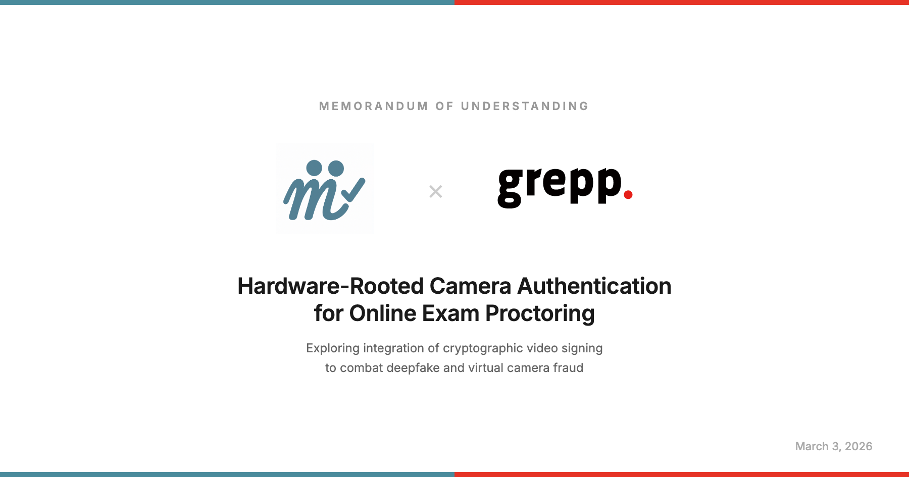
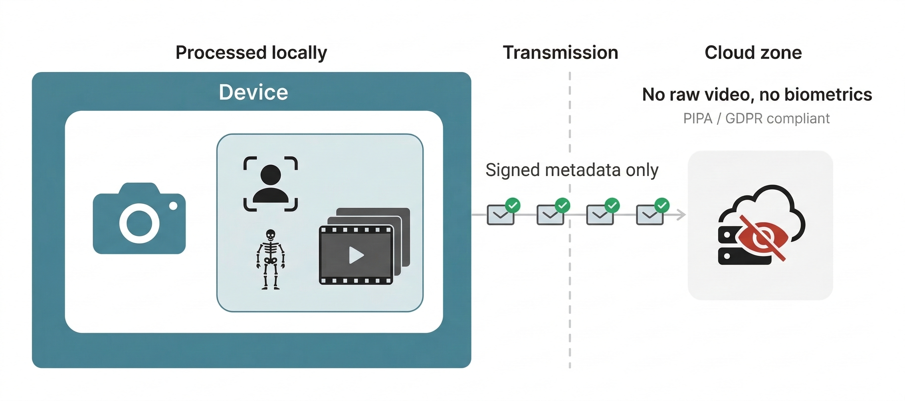

We signed an MOU with [Grepp](https://grepp.co) (CEO Samuel Sung-Soo Lim) to explore integrating mutual's hardware-based camera authentication into online exam proctoring.

## Why proctoring needs hardware authentication

Online proctoring has a structural problem. Tools like DeepFaceLive combined with OBS virtual cameras can swap faces in real-time on a webcam feed. VM cloaking tools like CloakBox make detection even harder. These aren't theoretical attacks - they're available to anyone with a browser and 10 minutes.

Software-level detection is playing whack-a-mole. Every time a proctoring system learns to detect one spoofing method, a new one appears. The fundamental issue: software can't reliably distinguish a physical camera from a virtual one.

mutual's approach flips the question. Instead of asking "does this video look suspicious?", we ask "did this video come from a real camera?" Hardware-bound cryptographic signatures can't be forged by virtual cameras - the signing key lives in the device's secure enclave.

## What the MOU covers

Grepp operates [Monito](https://monito.co.kr/), an online exam proctoring platform. The MOU establishes a framework for:

1. **Proof-of-Concept development** - mutual provides a prototype demonstrating frame-level signing and real-time verification in a physical camera environment, including on-device AI capabilities.
2. **Technical evaluation** - Grepp evaluates whether mutual's technology can integrate with Monito's existing proctoring pipeline and provides feedback.
3. **Joint exploration** - Both parties collaborate on advancing anti-fraud measures against generative AI and virtual camera attacks.

## Why on-device matters: computation and privacy

There's a second benefit beyond fraud prevention. When AI inference runs on the device itself, the architecture changes fundamentally.

**Cloud computation drops dramatically.** Traditional proctoring streams raw video to the cloud - roughly 2-4 Mbps per student at 720p. The cloud then runs face detection, gaze tracking, behavior analysis, and deepfake detection, all GPU-intensive. With on-device processing, the device handles frame signing, skeleton extraction, and basic behavior analysis locally. Only signed metadata and key frames go to the cloud - on the order of 10-50 Kbps. That's a ~98% bandwidth reduction.

Hardware signatures eliminate one of the heaviest workloads entirely: deepfake detection. If the signature verifies, the frame is authentic. No classifier needed. Server-side processing doesn't disappear - cross-student analysis (detecting communication between test-takers, correlating gaze patterns across sessions) still requires centralized computation. But the raw volume the server has to process shrinks dramatically when each device pre-processes locally and sends only verified metadata.

For a 1,000-student exam, this means the server no longer ingests 1,000 raw video streams for GPU inference. Instead, it receives 1,000 lightweight metadata streams, runs signature verification (microseconds per check on commodity hardware), and focuses server-side AI on the cross-student analysis that actually requires a global view.

**Privacy improves by default.** Raw video never needs to leave the device. Biometric data - faces, skeletal poses - is processed locally, and only anonymized or aggregated results are transmitted. A cloud breach doesn't expose student footage because the footage isn't there. This aligns with Korea's Personal Information Protection Act (PIPA) and GDPR requirements. The proctoring platform can verify exam integrity without ever seeing the student's face directly.

## Context

I reached out to CEO Lim on LinkedIn after studying the online proctoring market. His background - a PhD in Electrical and Computer Engineering from SNU - meant I could skip the analogies and talk architecture directly. After a video call, he offered to sign an MOU to support our government funding application.

This is an early-stage collaboration, not a product integration. Grepp's proctoring platform serves real customers with real exam integrity requirements. For us, this is validation that the problem we're solving matters to people who deal with it daily.

## What's next

We're building a demo that Grepp's development team can evaluate hands-on. When the technology is closer to product-ready, we'll move to a formal engagement.

*This post was drafted with Claude 4.6. Diagrams were generated with Nano Banana 2. All research, decisions, and editorial judgment are my own.*
