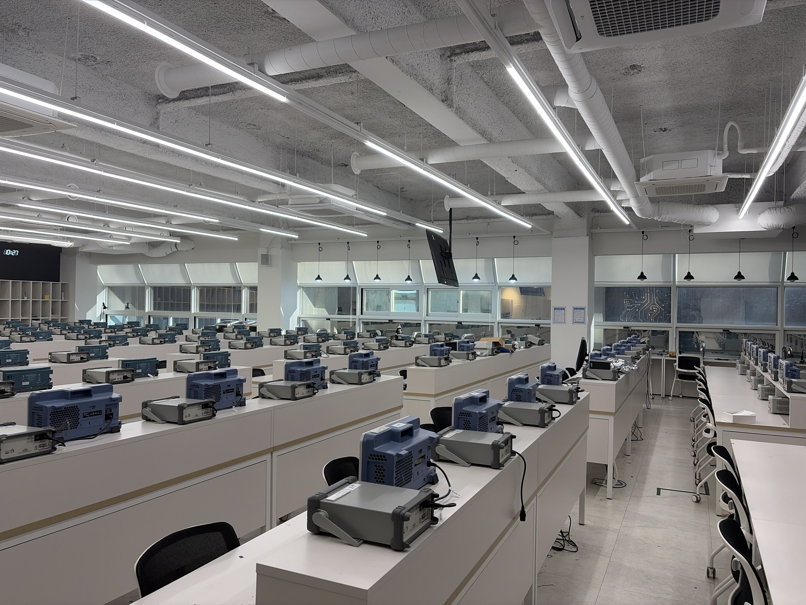
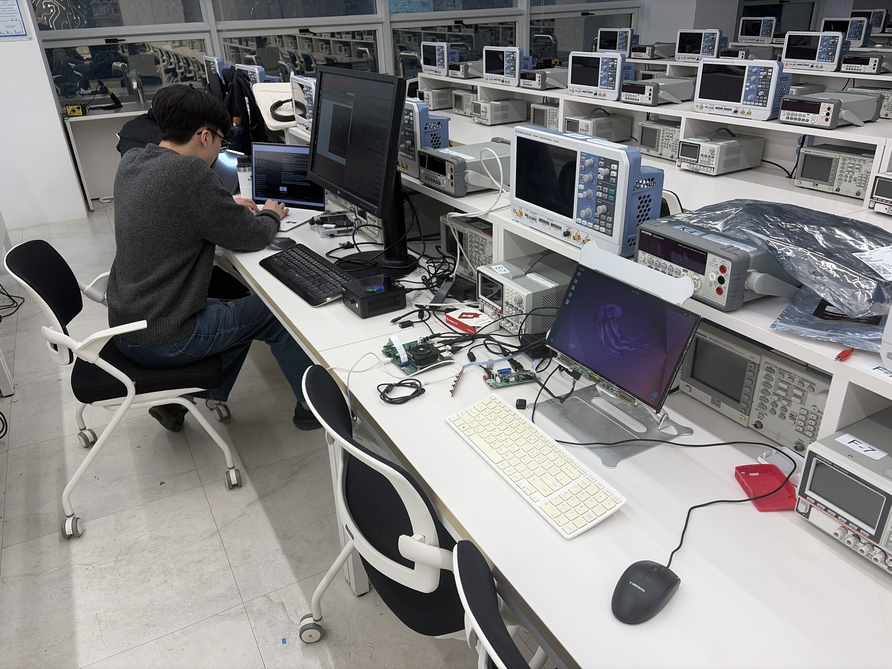
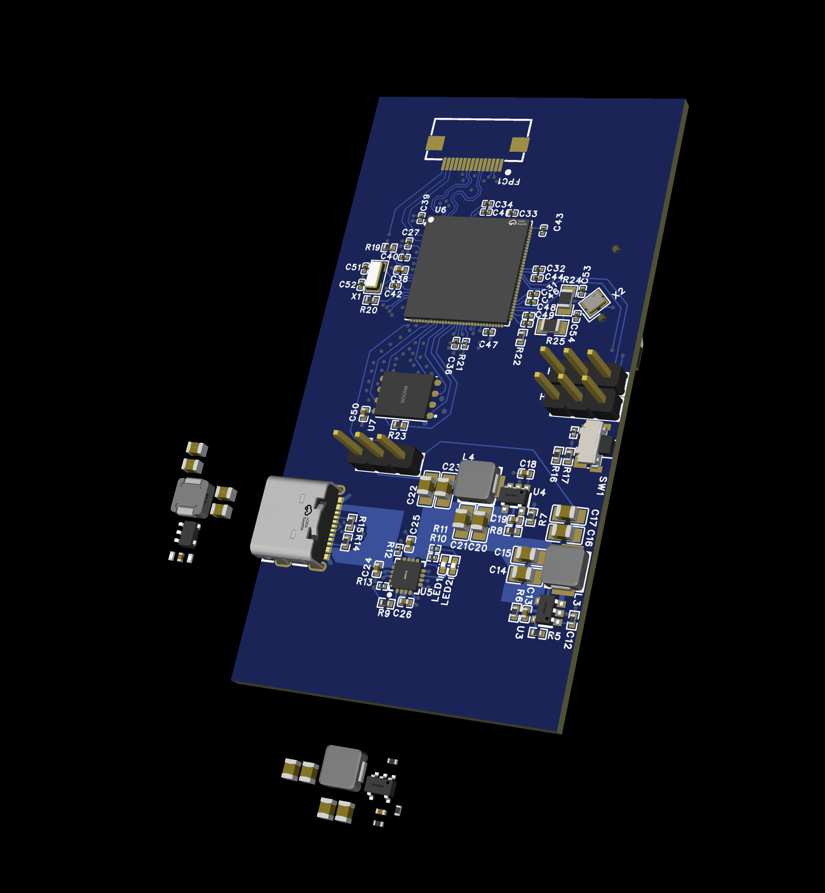
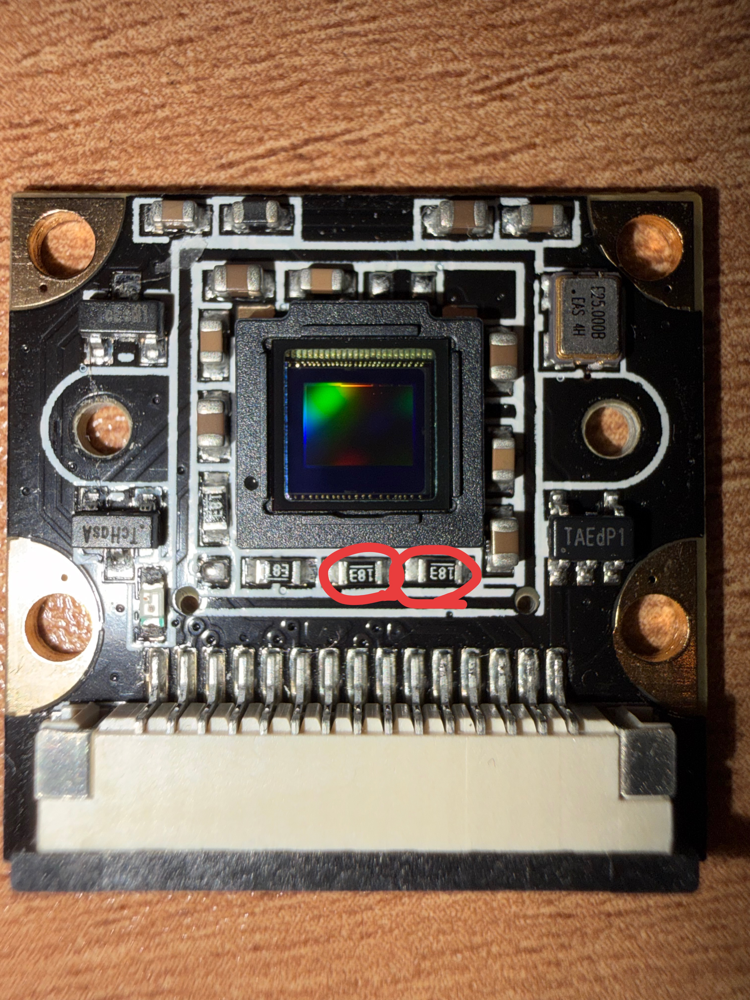
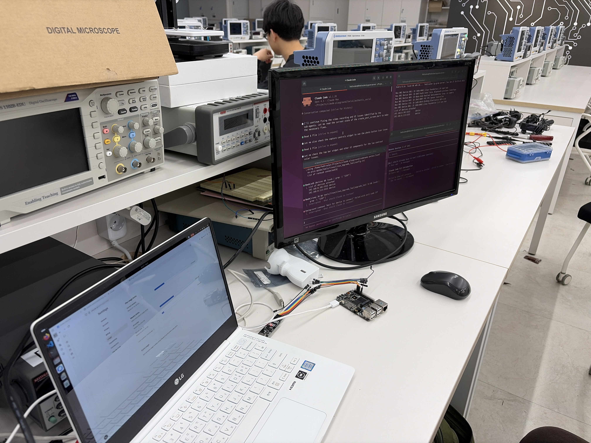
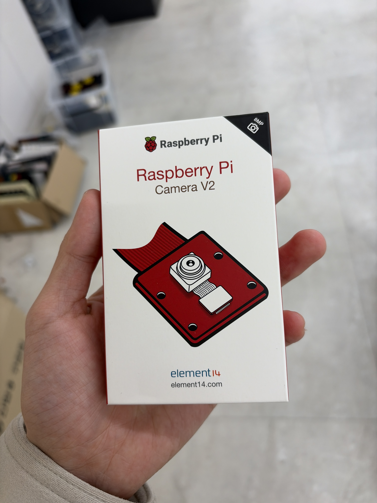

Two months into building mutual. Here's what January looked like.

## The Lab

We don't have an office. We're working out of Seoul National University's Building 301 - the EE lab.

*SNU Building 301.*

Hardware development needs equipment we can't afford to buy outright. Oscilloscopes, signal generators, power supplies, soldering stations. The lab has it all, and there are people around who actually know how to use it.

## What We're Building

The goal: sign image data at the hardware level, before any software can touch it.

We're using ARM TrustZone to create a secure world that hashes video frames as they come off the sensor. The output is designed to be [C2PA](https://c2pa.org/)-compatible - targeting verification in standard tools like Adobe's Content Credentials.

*Alex's first PCB design.*

No custom silicon. We're using the same class of chips that power budget IP cameras and dashcams, just configured differently.

## The Messy Parts

Camera modules don't always play nice with dev boards. We spent a week debugging an I2C issue that turned out to be a voltage mismatch - 3.3V pull-ups on the sensor fighting against 1.8V on our eval board.

*Had to desolder some 0402 resistors to fix this.*

This stuff doesn't show up in datasheets. You only find it when the bus refuses to enumerate and you're staring at the logic analyzer wondering what went wrong.

## The Hard Problem

Signing video in real-time is tricky. At 1080p30, there's a lot of data moving through the pipeline. Hash it too slowly and you drop frames. Hash it at the wrong point and you've already let untrusted code touch the pixels.

We have an approach that works, but there's still tuning to do.

*The workspace.*

## What's Next

February priorities:
- Small production run of the PCB
- End-to-end C2PA verification working
- Pilot kickoff with an insurance company for dashcam claims

*Also prototyping with off-the-shelf camera modules.*

---

*Day one.*

*When Alex's first boards came back from the fab.*

---

## We're Hiring

- [**Hardware Engineer (Co-Founder)**](/careers/cofounder-hardware/) · FPGA, crypto accelerators, camera interfaces
- [**Embedded Software Engineer**](/careers/embedded-engineer/) · Linux, TrustZone, camera pipelines
- [**Market Strategist**](/careers/market-strategist/) · customer discovery, pilots, GTM

If you work in insurance or content verification and want to pilot authenticated camera hardware, I'd like to hear from you.

[jangyejun@gmail.com](mailto:jangyejun@gmail.com)

*This post was drafted with the help of Claude. All research, decisions, and editorial judgment are my own.*
